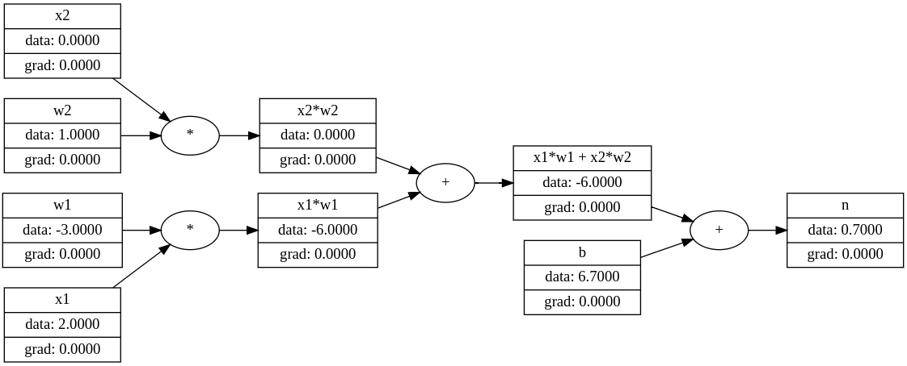

<!--# micrograd
Design Neural Network Architecture implementing forward pass and backpropagation on a small set of neurons packed in a network. 
Simple visualisation of states using directed acyclic graph helps in understanding the propagation of loss step by step and layer by layer through the network during the backward pass 
-->

# micrograd

micrograd is a minimalistic neural network library designed to facilitate an understanding of the inner workings of neural networks. This library provides a simple interface for designing neural network architectures, executing a forward pass, and performing backpropagation. It includes a small set of neurons organized into a network, and utilizes a directed acyclic graph for visualizing state propagation. This visualization aids in the step-by-step, layer-by-layer understanding of loss propagation during the backward pass.



## Features

- Design and implement simple neural network architectures.
- Perform forward passes and backpropagation.
- Visualize network state and loss propagation using directed acyclic graphs.

## Getting Started

### Prerequisites

Before installing `micrograd`, ensure you have the following prerequisites installed:
- Python 3.6 or higher
- Relevant Python libraries: `numpy`, `matplotlib` for visualization (if necessary)

### Installation

1. Clone the repository to your local machine:
    ```
    git clone https://github.com/[your-username]/micrograd.git
    ```
    
2. Navigate to the working directory:
    ```
    cd micrograd
    ```

3. Install the required dependencies:
     ```
     pip install -r requirements.txt
     ```
     
## Contributing

Contributions make the open-source community a fantastic place to learn, inspire, and create. Any contributions you make to this project are deeply appreciated.

1. Fork the Project
2. Create your Feature Branch (`git checkout -b feature/AmazingFeature`)
3. Commit your Changes (`git commit -m 'Add some AmazingFeature'`)
4. Push to the Branch (`git push origin feature/AmazingFeature`)
5. Open a Pull Request

## License

This project is licensed under the MIT License - see the `LICENSE` file for details.

## Contact

* Name - Jay Joshi
* Email - jayjoshi1109@gmail.com
* Project Link: https://github.com/jyjoshi/micrograd

## Acknowledgments

* Andrej Karpathy: https://github.com/karpathy/
